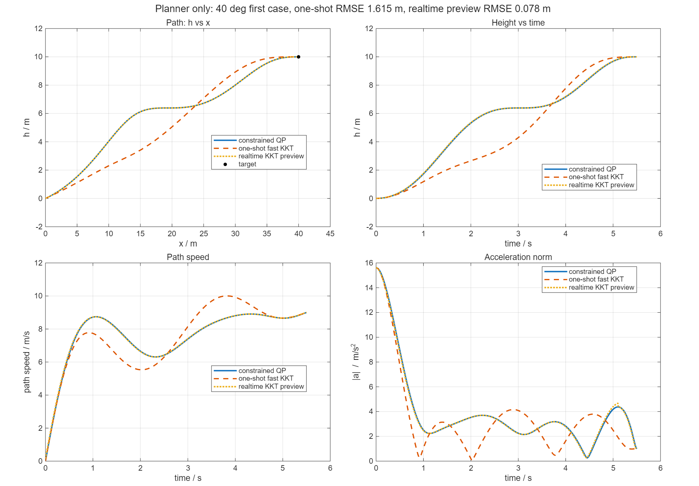

# 纯轨迹规划器输出说明

本目录只运行轨迹规划器，不包含 6DOF 动力学、控制器、控制分配、支架/地面力模型和 closed loop actual。

## 运行命令

在 MATLAB 中进入本仓库根目录后运行：

```matlab
run('scripts/run_first_case_qp_kkt.m')
```

## 工况

- 初始支角 `theta0 = 40.0 deg`
- 终端位置 `x_f = 40.0 m`
- 终端高度 `h_f = 10.0 m`
- 终端速度 `V_f = 9.0 m/s`
- 终端水平加速度 `a_x,f = 1.0 m/s^2`
- 终端垂向加速度 `a_h,f = 0.0 m/s^2`
- 总时间 `T = 5.50 s`
- release thrust acceleration `20.0 m/s^2`

该工况是本 standalone planner 仓库内置的第一个 40 deg 基础工况。

## 约束与语义

- 多项式阶数：`9`
- QP 检查点数：`140`
- 起点：`p0=[0,0,0]`, `v0=[0,0,0]`, `j0=[0,0,0]`
- 起点加速度由初始支角和 release thrust acceleration 估算。
- 终点：`pf=[x_f,0,-h_f]`, `vf=[V_f,0,0]`, `af=[a_x,f,0,-a_h,f]`, `jf=[0,0,0]`
- QP 使用高度单调、x 单调、航迹角约束、后段速度约束和高度进度上界。
- 高度进度上界：`tau=0.88`, `ratio=0.95`, `power=0.55`
- fast endpoint KKT shaping：`h_tau=[0.78 0.84]`, `h_ratio=[0.76 0.82]`, `vx_tau=0.60`, `vx_target=8.6 m/s`

## 输出文件

- `figures/qp_vs_fast_kkt_first_case.png`：QP、one-shot fast endpoint KKT 与 realtime KKT preview 对比图。
- `data/constrained_qp_trajectory.csv`：QP 轨迹数据。
- `data/fast_endpoint_kkt_trajectory.csv`：one-shot fast endpoint KKT 轨迹数据。
- `data/realtime_fast_kkt_preview_trajectory.csv`：realtime fast endpoint KKT preview 轨迹数据。
- `planner_only_summary.csv`：贴合指标。
- `planner_only_log.mat`：MATLAB 完整日志。

## 轨迹图像



## 本次结果

- QP exitflag：`1`
- QP max slack：`0.232802`
- KKT path RMSE：`1.615323 m`
- KKT x RMSE：`0.627530 m`
- KKT h RMSE：`1.488447 m`
- KKT speed RMSE：`0.882973 m/s`
- KKT endpoint x error：`-1.25056e-11 m`
- KKT endpoint h error：`9.54969e-12 m`
- KKT fit score：`19.23 / 100`

## realtime preview 结果

- realtime replan interval：`0.010 s`
- realtime command preview：`0.010 s`
- terminal passthrough threshold：`0.400 s`
- realtime preview 假设当前状态理想等于 QP 同时刻的 `p/v/a/j`，不接入真实动力学和控制器。
- 当剩余时间小于最小 horizon 时，不再构造人工 0.4 s 终端重规划，而是直接输出终端短预瞄状态，避免终端速度假跳变。
- realtime preview path RMSE：`0.077545 m`
- realtime preview x RMSE：`0.074352 m`
- realtime preview h RMSE：`0.022024 m`
- realtime preview speed RMSE：`0.044690 m/s`
- realtime preview endpoint x error：`0 m`
- realtime preview endpoint h error：`0 m`
- realtime preview fit score：`96.12 / 100`

## 注意

这里输出了两种 KKT 口径：one-shot shaped endpoint KKT 和 ideal-state realtime KKT preview。realtime preview 只验证规划器滚动重规划本体，不包含 controller command ref 和 actual closed loop。
